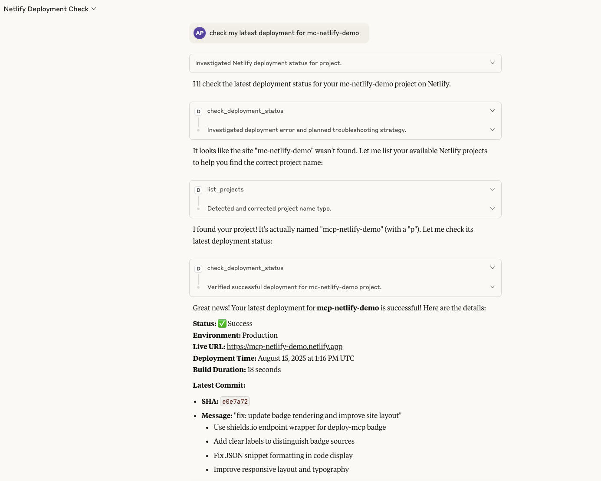

<div align="center">

# deploy-mcp

**Universal Deployment Tracker for AI Assistants**

Track deployments across all platforms directly in your AI conversation.  
No more context-switching. No more dashboard hunting.

[](https://www.npmjs.com/package/deploy-mcp)
[](https://github.com/alexpota/deploy-mcp/blob/main/LICENSE)
[](https://deploy-mcp.io)

</div>

---

## Demo

<div align="center">
  
  <kbd>
    <a href="./assets/demo.gif">
      
    </a>
  </kbd>
  
  <br /><br />
  
  <sub>**[Watch Full Demo](./assets/demo.gif)** · **[Live Badge Demo](https://mcp-netlify-demo.netlify.app/)**</sub>
  
</div>

---

## Quick Start
─────────────────────────

**Get started in under 30 seconds:**

```bash
npx deploy-mcp
```

That's it! The server is now running and ready to be configured in your AI assistant.

## Supported Platforms
─────────────────────────

deploy-mcp supports multiple deployment platforms simultaneously. Configure as many as you need:

| Platform | Status | Token Required | Features |
|----------|--------|---------------|----------|
| **Vercel** | ✅ Ready | `VERCEL_TOKEN` | Status, Logs, History, Real-time Monitoring |
| **Netlify** | ✅ Ready | `NETLIFY_TOKEN` | Status, Logs, History, Real-time Monitoring |
| **Railway** | Coming Soon | `RAILWAY_TOKEN` | - |
| **Render** | Coming Soon | `RENDER_TOKEN` | - |

### Multi-Platform Configuration

You can use **multiple platforms simultaneously** by providing tokens for each platform you want to track:

```json
{
  "mcpServers": {
    "deploy-mcp": {
      "command": "npx",
      "args": ["-y", "deploy-mcp"],
      "env": {
        "VERCEL_TOKEN": "your-vercel-token",
        "NETLIFY_TOKEN": "your-netlify-token"
        // Add more platform tokens as needed
      }
    }
  }
}
```

## Platform Configuration
─────────────────────────

### Vercel

<details>
<summary><strong>Setup Instructions</strong></summary>

1. **Get your API token:**
   - Go to [vercel.com/account/tokens](https://vercel.com/account/tokens)
   - Click "Create Token"
   - Give it a descriptive name (e.g., "deploy-mcp")
   - Copy the token

2. **Add to your AI assistant configuration:**
   ```json
   {
     "env": {
       "VERCEL_TOKEN": "your-vercel-token"
     }
   }
   ```

3. **Available commands:**
   - `"Check my Vercel deployment for project-name"`
   - `"What's the status of my latest Vercel deployment?"`
   - `"Show me Vercel deployment logs"`
   - `"Watch my Vercel deployment progress"`
   - `"List all my Vercel projects"`
   - `"Show last 5 deployments for project-name"`

4. **Required permissions:** Read access to deployments and projects

</details>

### Netlify

<details>
<summary><strong>Setup Instructions</strong></summary>

1. **Get your API token:**
   - Go to [app.netlify.com/user/applications](https://app.netlify.com/user/applications)
   - Under "Personal access tokens", click "New access token"
   - Give it a descriptive name (e.g., "deploy-mcp")
   - Copy the token

2. **Add to your AI assistant configuration:**
   ```json
   {
     "env": {
       "NETLIFY_TOKEN": "your-netlify-token"
     }
   }
   ```

3. **Available commands:**
   - `"Check my Netlify deployment for site-name"`
   - `"What's the status of my latest Netlify deployment?"`
   - `"Show me Netlify deployment logs"`
   - `"Watch my Netlify deployment progress"`
   - `"List all my Netlify sites"`
   - `"Show deployment history for site-name"`

4. **Required permissions:** Read access to sites and deploys

</details>

## AI Assistant Configuration
─────────────────────────

deploy-mcp works with any MCP-compatible AI assistant. Here's how to set it up:

### Claude Desktop

<details>
<summary><strong>Configuration</strong></summary>

**File location:**
- **macOS**: `~/Library/Application Support/Claude/claude_desktop_config.json`  
- **Windows**: `%APPDATA%\Claude\claude_desktop_config.json`  
- **Linux**: `~/.config/Claude/claude_desktop_config.json`

**Configuration:**
```json
{
  "mcpServers": {
    "deploy-mcp": {
      "command": "npx",
      "args": ["-y", "deploy-mcp"],
      "env": {
        "VERCEL_TOKEN": "your-vercel-token",
        "NETLIFY_TOKEN": "your-netlify-token"
      }
    }
  }
}
```

</details>

### VS Code

<details>
<summary><strong>Configuration</strong></summary>

**File location:**
- Workspace: `.vscode/mcp.json`
- Global: `~/.vscode/mcp.json`

**Requirements:** GitHub Copilot subscription with MCP enabled

**Configuration:** Same as Claude Desktop

</details>

### Cursor AI

<details>
<summary><strong>Configuration</strong></summary>

**File location:** `~/.cursor/mcp.json`

**Setup:** Navigate to Cursor Settings → MCP

**Configuration:** Same as Claude Desktop

</details>

### Windsurf IDE

<details>
<summary><strong>Configuration</strong></summary>

**File location:** `~/.codeium/windsurf/mcp_config.json`

**Setup:** Settings → Advanced Settings → Cascade

**Configuration:** Same as Claude Desktop

</details>

### Continue.dev

<details>
<summary><strong>Configuration</strong></summary>

**File location:** `~/.continue/config.json`

**Configuration (different structure):**
```json
{
  "experimental": {
    "modelContextProtocolServer": {
      "transport": {
        "type": "stdio",
        "command": "npx",
        "args": ["-y", "deploy-mcp"]
      },
      "env": {
        "VERCEL_TOKEN": "your-vercel-token",
        "NETLIFY_TOKEN": "your-netlify-token"
      }
    }
  }
}
```

</details>

### Cline (VS Code Extension)

<details>
<summary><strong>Configuration</strong></summary>

**Natural language setup:**
- Ask: *"Add the deploy-mcp tool to check deployments"*

**Manual setup:**
- MCP Servers icon → Advanced MCP Settings

**Configuration:** Same as Claude Desktop

</details>

## Deployment Status Badges
─────────────────────────

Get live deployment status badges for your repositories:

### Badge Format

The deploy-mcp.io endpoint returns JSON data for shields.io. Use the shields.io endpoint wrapper:

```markdown

```

### Examples by Platform

#### Vercel Badge
```markdown

```

#### Netlify Badge
```markdown

```

#### Multiple Badges
```markdown


```

### Webhook Configuration

For real-time badge updates, configure webhooks:

<details>
<summary><strong>Vercel Webhooks</strong> (Pro/Enterprise only)</summary>

1. Go to your Vercel team settings
2. Navigate to "Webhooks" section
3. Click "Create Webhook"
4. Configure:
   - **URL**: `https://deploy-mcp.io/webhook/{username}/{repo}/vercel`
   - **Events**: Deployment Created, Ready, Error
   - **Projects**: Select specific or all

</details>

<details>
<summary><strong>Netlify Webhooks</strong></summary>

1. Go to Site Settings → Build & deploy → Deploy notifications
2. Add notification → Outgoing webhook
3. Configure:
   - **URL**: `https://deploy-mcp.io/webhook/{username}/{repo}/netlify`
   - **Events**: Deploy started, succeeded, failed

</details>

**Note:** Badges require public repositories. Private repo support coming soon.

## Available Tools
─────────────────────────

deploy-mcp provides these tools to your AI assistant:

### Core Tools

| Tool | Description | Example Command |
|------|-------------|-----------------|
| `check_deployment_status` | Get latest deployment status or history | *"Check my deployment status"* / *"Show last 5 deployments"* |
| `watch_deployment` | Monitor deployment in real-time | *"Watch my deployment progress"* |
| `compare_deployments` | Compare recent deployments | *"Compare my last 2 deployments"* |
| `get_deployment_logs` | Fetch deployment logs | *"Show me deployment logs"* |
| `list_projects` | List all available projects | *"List my Vercel projects"* / *"Show all Netlify sites"* |

### Platform-Specific Usage

Commands work across all configured platforms:

```
"Check my Vercel deployment for my-app"
"Show last 10 deployments for my-app on Vercel"
"List all my Vercel projects"
"Check my Netlify deployment for my-site"
"Show me logs for deployment abc123 on Vercel"
"Watch my Netlify deployment progress"
"Show all my Netlify sites"
```

### New Features

#### List Projects
Discover all your projects/sites across platforms:
```
"List my Vercel projects"
"Show all Netlify sites"
"What projects do I have on Vercel?"
```

#### Deployment History
View multiple recent deployments at once:
```
"Show last 5 deployments for my-app"
"Get deployment history for my-site"
"Check last 10 deployments on Vercel"
```

The AI will automatically use the correct platform based on:
1. Explicit platform mention in your command
2. Project/site name matching
3. Available tokens in configuration

## Security
─────────────────────────

- **Local tokens only** - Your API tokens stay on your machine
- **No telemetry** - We don't track usage or collect data
- **Open source** - Fully auditable codebase
- **Minimal permissions** - Only read access required

## Advanced Configuration
─────────────────────────

### Environment Variables

You can also set tokens via environment variables:

```bash
export VERCEL_TOKEN="your-vercel-token"
export NETLIFY_TOKEN="your-netlify-token"
npx deploy-mcp
```

### Custom Installation

For production use, install globally:

```bash
npm install -g deploy-mcp
deploy-mcp
```

## Contributing
─────────────────────────

We welcome contributions! See [CONTRIBUTING.md](CONTRIBUTING.md) for guidelines.

### Adding New Platforms

1. Implement the `BaseAdapter` interface
2. Add platform-specific API client
3. Update configuration documentation
4. Add tests

## License
─────────────────────────

Apache 2.0 - See [LICENSE](LICENSE) for details.

## Links
─────────────────────────

- [Website](https://deploy-mcp.io)
- [npm Package](https://www.npmjs.com/package/deploy-mcp)
- [GitHub Repository](https://github.com/alexpota/deploy-mcp)
- [Report Issues](https://github.com/alexpota/deploy-mcp/issues)

---

<div align="center">
Made with ❤️ for developers who love AI-assisted coding
</div>